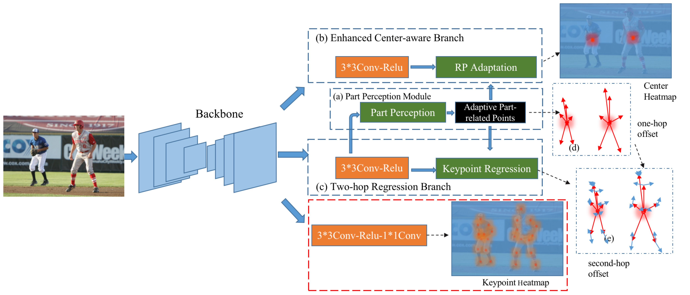

# AdaptivePose++: A Powerful Single-Stage Network for Multi-Person Pose Regression
The current code can reproduce the results reported in AdaptivePose++.

👏👏👏👏👏👏👏👏👏👏👏a compact and powerful single-stage multi-person pose estimation framework:

> [**AdaptivePose: Human Parts as Adaptive Points**](https://arxiv.org/abs/2112.13635),            
> Yabo Xiao, Dongdong Yu, Xiaojuan Wang, Guoli Wang, Qian Zhang, Mingshu He;        
> *Published on AAAI2022*   
> [**AdaptivePose++: A Powerful Single-Stage Network for Multi-Person Pose Regression**](https://arxiv.org/abs/2210.04014)      
> Yabo Xiao, Xiaojuan Wang, Dongdong Yu, Kai Su, Lei Jin, Mei Song, Shuicheng Yan, Jian Zhao;      

<!-- Contact: [xiaoyabo@bupt.edu.cn](mailto:xiaoyabo@bupt.edu.cn). Any questions or discussions about pose estiamtion task are welcomed!  -->

## Abstract 

Multi-person pose estimation generally follows top-down and bottom-up paradigms. Both of them use an extra stage (e.g., human detection in top-down paradigm or grouping process in bottom-up paradigm) to build the relationship between the human instance and corresponding keypoints, thus leading to the high computation cost and redundant two-stage pipeline. To address the above issue, we propose to represent the human parts as adaptive points and introduce a fine-grained body representation method. The fine-grained body representation is able to granularity encode the diverse pose information and effectively model the relationship between the human instance and corresponding keypoints in a single-forward pass. With the proposed body representation, we further deliver a compact single-stage multi-person pose regression network, termed as AdaptivePose. During inference, our proposed network only needs a single-step decode operation to form the multi-person pose without complex post-processes and refinements. We employ AdaptivePose for both 2D/3D multi-person pose estimation tasks to verify the effectiveness of AdaptivePose. Without any bells and whistles, we achieve the most competitive performance on MS COCO and CrowdPose in terms of accuracy and speed. Furthermore, the outstanding performance on MuCo-3DHP and MuPoTS-3D further demonstrates the effectiveness and generalizability on 3D scenes.

## Highlights

- **Simple:** Adaptivepose is a effecient and powerful single-stage multi-person pose estimation pipeline which can effectively model the relationship between the human instance and corresponding keypoints in a single-forward pass. 

- **Generalizability:** AdaptivePose is able to achieve the competitive performance on crowded and 3D scenes.

- **Fast:** AdaptivePose is a very compact MPPE pipeline. During inference, we eliminate the heuristics grouping, and do not require any refinements and other hand-crafted post-processes except for center NMS. 

- **Strong**: AdaptivePose uses center feature together with the features at adaptive human part-related points to encode diverse human pose sufficiently. It outperforms the existing bottom-up and single-stage pose estimation approaches without the flip and multi-scale testing in terms of speed and accuracy.


<!-- - **Easy to use:** We provide user friendly testing API and webcam demos. -->

## Main results

### The single-stage multi-person pose estimation on COCO validation
<!-- - **Speed** Please refer to the paper(https://arxiv.org/abs/2112.13635) for inference time 🚀🚀🚀. The performance is slightly better than the reported in paper. -->
The time is calculated on a single Tesla V100,  which is more faster than the speed reported in paper.
We found that stacking more 3*3 conv-relu in each brach can further improve the performance


We further employ the OKS loss for regression head and achieve the better performance without Inference overhead. Outperforming all bottom-up and single-stage methods with faster speed !!! 🚀🚀🚀🚀🚀🚀🚀🚀🚀🚀🚀🚀🚀🚀🚀

| Backbone     | inp_res |  AP       | Flip AP      |  Multi-scale AP.  |   download  |time/ms|
|--------------|---------|-----------|--------------|-------------------|   ---    | --- |
|DLA-34        |   512   |   67.0    |   67.4       | 69.2    | [model](https://drive.google.com/file/d/1AFsD619kxt90lBp5bDhqDtOAAm1O_li_/view?usp=share_link)  | 33| 
|HRNet-W32        |   512   |   68.6    |   69.1       | 71.2    | [model](https://drive.google.com/file/d/1mzGuVczYBzE0B1zsRFL_FMNJEcW4Cr-B/view?usp=share_link) |46 | 
|HRNet-W48     |   640   |    71.0   |     71.5     |  73.2 |   [model](https://drive.google.com/file/d/147GwtZ4Ht3xQkVIbPJDRtVNhAQeL1rPB/view?usp=share_link)  | 57 |


### The single-stage multi-person pose estimation on CrowdPose test.

| Backbone     | inp_res |  AP       | Flip AP      |  Multi-scale AP.  |   download  |time/ms|
|--------------|---------|-----------|--------------|-------------------|   ---    | --- |
|HRNet-W32        |   512   |   67.5    |   68.0       | 69.3    | [model](https://drive.google.com/file/d/14LQupokqqi-kgRQeh2vU6Fa82iujcKQs/view?usp=share_link) |46 | 
|HRNet-W48     |   640   |    70.4   |     71.0     |  72.6 |   [model](https://drive.google.com/file/d/1Wv20VnH_ngPqeYGBcDG6qy_uU6w6t0wc/view?usp=share_link)  | 57 |


<!-- ## Installation
All models and details will be available in our [Model zoo](readme/MODEL_ZOO.md). -->

## Prepare env
The conda environment torch12 can be downloaded directly from [torch12.tar.gz](https://drive.google.com/file/d/1hAtuIbLHlKpt2YN_zUxkqHtUhDvsNn4u/view?usp=sharing).
The path should like this AdaptivePose/torch12.tar.gz
and then following
```
source prepare_env.sh
```

In another way, you also can deploy the environment following
```
source prepare_env2.sh
```

## Prepare Data and pretrain models
Follow the instructions in [DATA.md](readme/DATA.md) to setup the datasets. 
Or link dataset path to AdaptivePose/data/
```
cd AdaptivePose
mkdir -p data/coco
mkdir -p data/crowdpose
ln -s /path_to_coco_dataset/ data/coco/
ln -s /path_to_crowdpose_dataset/ data/crowdpose/
```

The pretrain models can be downloaded from [pretrain_models](https://drive.google.com/drive/folders/17DVq-pwqx40ELmbBjYEYVQc1UC9ofgsq?usp=sharing), put the pretrain models into AdaptivePose/models


## Training and Testing

After preparing the environment and data, you can train or test AdaptivePose with different network and input resolution. ___🚀🚀🚀 Note that the image resolution can be optionally adjusted according to user's requirements for obtaining the different speed-accuracy trade-offs! 🚀🚀🚀___

DLA34 with 512 pixels:
```
cd src
bash main_dla34_coco512.sh
```
HRNet-W32 with 512 pixels:
```
cd src
bash main_hrnet32_coco512.sh
```

HRNet-W48 with 640 pixels:
```
cd src
bash main_hrnet48_coco640.sh
```

## Running demo 

The input aspect ratio is closer to 1, the  speed is faster ！！！

visualize coco 


```
torch12/bin/python test.py multi_pose_wodet --exp_id $EXPNAME --dataset coco_hp_wodet --resume --not_reg_offset --not_reg_hp_offset --K 20 --not_hm_hp --arch $ARCNAME --input_res $RES --keep_res --debug 1
```

visualize customized image 

```
torch12/bin/python demo.py multi_pose_wodet --exp_id $EXPNAME --dataset coco_hp_wodet --resume --not_reg_offset --not_reg_hp_offset --K 20 --not_hm_hp --arch $ARCNAME --input_res $RES --keep_res --debug 1 --demo path/to/image_dir --vis_thresh 0.1
```

visualize customized video 

```
torch12/bin/python demo.py multi_pose_wodet --exp_id $EXPNAME --dataset coco_hp_wodet --resume --not_reg_offset --not_reg_hp_offset --K 20 --not_hm_hp --arch $ARCNAME --input_res $RES --keep_res --debug 1 --demo path/to/xx.mp4 --vis_thresh 0.1 
```
https://user-images.githubusercontent.com/71114006/212531482-c02d6f04-2076-48fe-93d0-0e102536a1e6.mp4   


https://user-images.githubusercontent.com/71114006/212531759-692fc7ac-d0b9-468a-b7db-7ba83a253947.mp4


## Develop

AdaptivePose is built upon the codebase of CenterNet. If you are interested in training AdaptivePose in a new pose estimation dataset, or add a new network architecture, please refer to [DEVELOP.md](readme/DEVELOP.md). Also feel free to send me emails(xiaoyabo@bupt.edu.cn) for discussions or suggestions.


## Citation

If you find this project useful for your research, please use the following BibTeX entry.
```
  @inproceedings{xiao2022adaptivepose,
  title={Adaptivepose: Human parts as adaptive points},
  author={Xiao, Yabo and Wang, Xiao Juan and Yu, Dongdong and Wang, Guoli and Zhang, Qian and Mingshu, HE},
  booktitle={Proceedings of the AAAI Conference on Artificial Intelligence},
  volume={36},
  number={3},
  pages={2813--2821},
  year={2022}
}

@article{xiao2022adaptivepose++,
  title={AdaptivePose++: A Powerful Single-Stage Network for Multi-Person Pose Regression},
  author={Xiao, Yabo and Wang, Xiaojuan and Yu, Dongdong and Su, Kai and Jin, Lei and Song, Mei and Yan, Shuicheng and Zhao, Jian},
  journal={arXiv preprint arXiv:2210.04014},
  year={2022}
}
```
